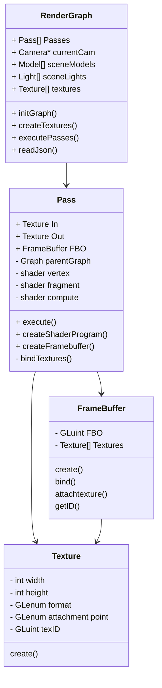

# GIMasterProject
Global Illumination Master Project Harry Tombs

```mermaid
classDiagram
class RenderGraph{
+ Pass[] Passes
+ Camera* currentCam
+ Model[] sceneModels
+ Light[] sceneLights
+ Texture[] textures
+ initGraph()
+ createTextures()
+ executePasses()
+ readJson()
}

class Pass {
+ Texture In
+ Texture Out
+ FrameBuffer FBO
- Graph parentGraph
- shader vertex
- shader fragment
- shader compute
+ execute()
+ createShaderProgram()
+ createFramebuffer()
- bindTextures()
}

class FrameBuffer{
- GLuint FBO
- Texture[] Textures
create()
bind()
attachtexture()
getID()
}

class Texture{
- int width
- int height
- GLenum format
- GLenum attachment point
- GLuint texID
create()
}

RenderGraph --> Pass
Pass --> FrameBuffer
Pass --> Texture
FrameBuffer --> Texture

```
